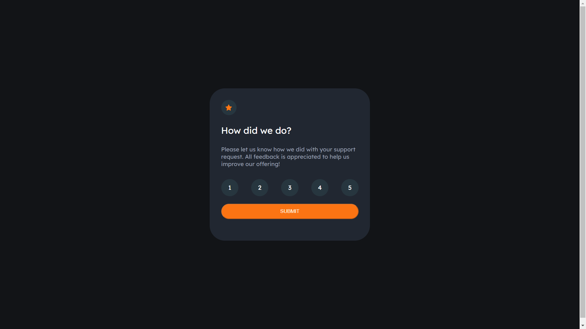
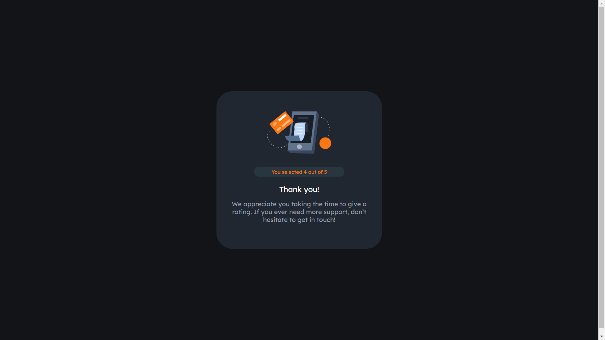

# Frontend Mentor - Interactive rating component solution

This is a solution to the [Interactive rating component challenge on Frontend Mentor](https://www.frontendmentor.io/challenges/interactive-rating-component-koxpeBUmI).

## Table of contents

- [Overview](#overview)
  - [The challenge](#the-challenge)
  - [Screenshot](#screenshot)
  - [Links](#links)
- [My process](#my-process)
  - [Built with](#built-with)
  - [Continued development](#continued-development)
- [Author](#author)

## Overview

### The challenge

Os usuários devem ser capazes de:

- Ver um layout apropriado independente do dispositivo que usar
- Ver a mudança de cores e animação ao passar o mouse sobre todos os botões da tela
- Selecionar e enviar uma nota pelo card
- Ver uma mensagem de agradecimento após enviar uma nota

### Screenshot

### Links

- Solution URL: [Add solution URL here](https://your-solution-url.com)

## My process

### Built with

- Semantic HTML5 markup
- CSS custom properties
- Flexbox
- CSS Grid
- JavaScript

### Continued development

Esse projeto faz parte do portfólio para criação com foco em front end, que é continuada. Haverão posteriores em projetos próximos. 

## Author

- Github - [RuanVPSantos](https://github.com/RuanVPSantos)
- Frontend Mentor - [@RuanVPSantos](https://www.frontendmentor.io/profile/RuanVPSantos)
- Linkedin - [Ruan Santos](https://www.linkedin.com/in/ruan-santos-a1318a219/)
